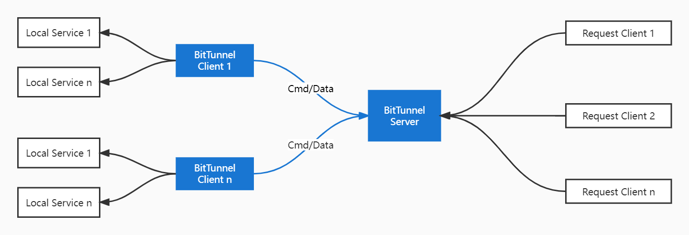

## Bit-Tunnel 使用说明

> Author: 李晓军
> Date: 2022-10-07
### 概览

Bit-Tunnel 是一个内网穿透的反向代理应用，当前版本支持 TCP、HTTP 协议。可以将内网服务以安全、便捷的方式通过具有公网 IP 的服务器中转暴露到公网。

Bit-Tunnel 由客户端和服务端组成，服务端部署在具有公网 IP 的机器上，客户端通常部署在需要穿透的内网服务所在的机器上。用户通过访问服务端对外代理的端口，由 Bit-Tunnel 负责根据请求的端口或其他信息将请求路由到对应的内网机器，从而实现通信。




### 安装

Bit-Tunnel 采用 Python 编写，支持跨平台，仅需下载对应平台的二进制文件即可执行，没有额外依赖。
解压缩下载的压缩包，将其中的 bit-tunnel-client 拷贝到内网服务所在的机器上，将 bit-tunnel-server 拷贝到具有公网 IP 的机器上，放置在任意目录。编写配置文件，通过 ./bit-tunnel-server 启动服务端，再通过 ./bit-tunnel-client 启动客户端。


### 如何访问内网的 Web 服务

这个示例通过简单配置 HTTP 类型的代理让用户访问到内网的 Web 服务。

配置bts.ini文件:

```js
[common]
#公网服务器IP
bind_ip = x.x.x.x
#客户端通讯端口
bind_port = 9177
```

配置btc.ini文件:

```js
[common]
#公网服务器IP
server_ip = x.x.x.x
#公网服务器通讯端口
server_port = 9177
#用户名
username = test
#密码
password = 12345678
#http公网对外服务端口
http_proxy_port = 9080

[web]
type = http
#本地服务IP
local_ip = 127.0.0.1
#本地服务端口
local_port = 80
#http公网对外服务域名
domains = bit-tunnel.xxx.com
```

分别启动 bit-tunnel-server 和 bit-tunnel-client。

通过浏览器访问 http://bit-tunnel.xxx.com:9080  即可访问到处于内网机器上 80 端口的服务，如果没有设置domains 则访问 http://x.x.x.x:9080。
